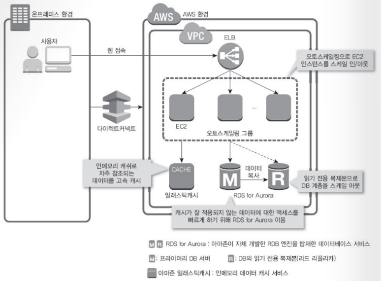

#### 인프라 핵심 설계 사항

1. 오토스케일링을 사용한 동적 프로비저닝
2. 인메모리 데이터 액세스 사용
   - 높은 빈도로 액세스 되는 데이터는 인메모리 캐시를 사용하여 데이터 액세스 지연을 줄인다.
3. 고속의 RDB 서비스 이용
   - Aurora 활용

#### 데이터 액세스에 걸리는 지연 시간 줄이기

1. Amazon ElasticCache - 인메모리 캐시 서비스

2. RDS

   - RDS의 6종류의 DB엔진 중 MySQL과 호환되는 Amazon Aurora 엔진 사용

   

#### 애플리케이션 서버의 스케일 아웃 자동화하기

#### 자동 배포로 오토스케일링을 간편하게 적용하기

1. 애플리케이션 환경의 배포

   - 오토스케일링에서 인스턴스가 시작되고 나서  요청을 처리할 수 있으려면, 실행 환경을 제공하여 배포하야 한다.

   - 배포된 AMI를 다시 만들어야 하지만 출시 빈도가 잦을 경우는 운용이 복잡하다.

   - 빈도가 높을때는 인스턴스 시작 시에 배포를 자동으로 실행하는 구조를 마련한다.

     EC2 생성 시, 

