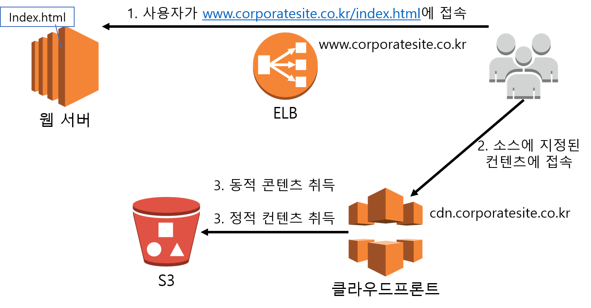

### 다중화로 가용성 확보 & 서비스 활용으로 비용 절감 (CDN & S3)

#### 정적 콘텐츠 전달 비용 줄이기

##### 클라우드 프론트

클라우드 프론트는 CDN의 일종으로 전세계에 배치된 서버에서 콘텐츠를 캐시하고 전달한다

캐시에 'Hit'한 경우 웹 서버와 DB서버에 접속하지 않으므로 서버의 부하를 낮춰 운영비 절감.

1. 클라우드 프론트로 전송하는 콘텐츠 소스 속성 지정

   ~~~
   <script
   language="javascript" src=http://cdn.corporatesite.co.kr/javascript/common.js>
   ~~~

2.  브라우저는 클라우드 프론트에서 콘텐츠를 가져옴

   클라우드 프론트에 캐시 되지 않은 콘텐츠는 ELB로 가지러 간다. 사용자가 액세스한 콘텐츠는 클라우드프론트에 캐시가 된다.

   - S3에 파일을 저장하면 파일 단위로 접속용 URL이 생성되고 이것을 정적 콘텐츠 저장소로 사용한다.

3. 클라우드프론트의 참조 분리 기능을 이용하여 동적 자료는 ELB에서, 정적 자료는 S3에서 가져울 수 있다.

   - URL 와일드 카드를 지정하여 정적 및 동적 콘텐츠를 구별 할 수 있다는 것을 전제로 함
   - 디렉토리 구성이나 파일 네이밍이 복잡한 경우 설정도 복잡하니, 네이밍 규칙 고려
   - 시스템 운용 이후에도 추가하여 사용할 수 있다.

##### 기업 웹사이트에 적합한 인스턴스를 설계하려면 ELB 볼륨 고려

<a href =  https://docs.aws.amazon.com/ko_kr/AWSEC2/latest/UserGuide/EBSVolumeTypes.html>

   

