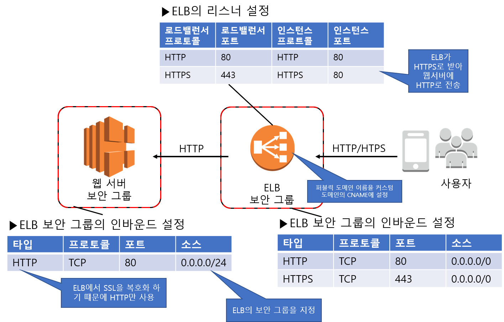

### 다중화로 가용성 확보 & 서비스 활용으로 비용 절감 (ELB)

#### 인프라 핵심 설계 사항

1. 웹 서버 다중화

   - 로드밸런서로 장애에 대비하고 부하가 높아진 경우에 대비해 웹 서버 추가를 가능하게 한다.

     ex) 가상 서버인 EC2와 가상 저장소인 EBS를 사용하여 구축, 웹서버는 로드밸런서(ELB)를 사용하여 다중으로 구성함.

2. DB 서버 다중화

   - 서비스 기능을 사용하여  DB 서버를 복제한다.

     ex) RDS로 구성, 셋업이 완료된 RDBMS 환경을 이용할 수 있음.

3. CDN과 객체 저장소를 사용한 정적 콘텐츠 전송

   - 웹 서버로의 접속을 줄여 운영 비용을 절감한다.

     ex) 정적 콘텐츠 전송에 이용하는 CDN 서비스가 Amazon CloudFront, 객체 저장소 서비스가 S3이다.

     CDN은 전 세계에 배치된 서버를 통해 웹 접속을 캐시하거나 분배하는 서비스다. CDN을 사용하면 응답 속도를 높이거나 웹 서버로의 접속을 줄일 수 있다. 객체 저장소는 객체 단위로 데이터를 다루는 스토리지로서 REST API를 사용하여 데이터의 입출력을 수행한다.

#### ELB를 이용하여 웹 서버 다중화하기

ELB를 웹 트래픽의 입구로 사용하여 트래픽이 복수의 웹 서버에 분산되도록 한다.

1. 인터넷 접속 End Point를 ELB로 지정한다. IP주소가 아닌 CNAME(대체 도메인 이름)을 지정하여 접속한다. ELB의 IP주소는 고정아 아니라 계속 변하기 때문이다. DNS서버인 아마존 라우트53을 이용하여 ELB의 CNAME과 사용할 도메인 이름을 연결시킨다. 이러한 설정에 의해 최종 사용자는 도메인 이름을 통해 ELB에 접속 할 수 있다.
2. ELB 와 웹서버의 EC2 인스턴스를 연결시킨다.

##### 주의사항

- ELB용과 웹 서버용으로 각각 다른 보안 그룹을 마련하자.

  ELB는 인터넷 어디에서라도 HTTP와 HTTPS 접속을 허용하는 반면에 웹서버는 HTTP요청만을 받아들이므로  트래픽 소스를 ELB가 속한 서브넷 만으로 한정합니다. 서브넷으로 설정하는 이유는 ELB만의 IP주소가 바뀔 가능성이 있기 때문이다. 개별 웹서버에 직접 적속하면 ELB의 제어가 제대로 작동하지 않게 된다.

  

- 세션 유지 기능의 유무

  세션 정보를 웹 서버 간에 공유하는 구조를 마련하지 않으면 동일한 클라이언트 접속을 항상 같은 웹서버에 유지시켜야 한다. ELB는 ELB 자신이 작성하는 쿠키 정보를 바탕으로 동일한 서버로 접속을 유지시키는 세션 유지 기능을 제공한다. (매니지먼트 콘솔에서 설정 가능)

- HTTPS 처리

  HTTPS 통신은 클라이언트와 서버 간의 통신을 암호화한다. ELB는 SSL Termination이라고 하는 SSL 인증서 확인 및 암호화/복호화 처리 기능을 제공한다. ELB리스너 설정에서는 로드밸런서 프로토콜을 HTTPS로, 인스턴스의 프로토콜을 HTTP로 하면 자동적으로 적용된다. (웹 서버별로 SSL증명서를 관리할 필요가 없어질 뿐만 아니라, SSL복호화 처리에 걸리는 부하가 줄어들어 EC2 인스턴스의 비용을 줄인다.)

- 헬스 체크

  헬스 체크를 통해 웹 서버가 정상적으로 동작하는지를 감시한다.

  default - Interval(30sec), Time out - (5sec), Unhealthy threshold - (2회)

  웹  서버에 장애가 발생하면 40 ~ 70초 만에 감지하여 서버를 분리함.

  너무 짧아서도 길어서도 안되니 성능 시험시에 수치를 조정하자

- 응답시간에 따른 타임아웃 설정

  웹 서버에 분산시킨 후 일정시간 응답이 없으면, ELB는 웹 서버와의 접속을 절단하고, 클라이언트에 HTTP 504를 반환함. 타임 아웃 시간은 접속 설정의 타임아웃으로 설정하며, default - 60sec. DB처리등 시간이 걸리는 작업은 시간을 길게 설정