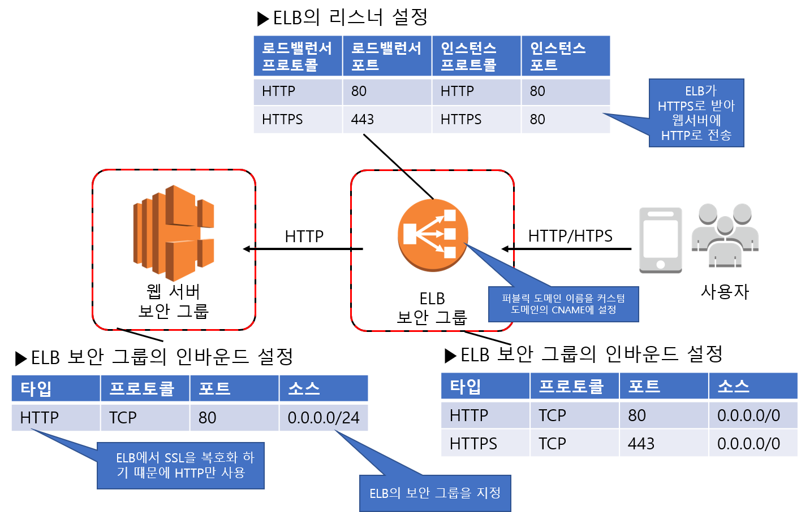

### 다중화로 가용성 확보 & 서비스 활용으로 비용 절감

#### 인프라 핵심 설계 사항

1. 웹 서버 다중화

   - 로드밸런서로 장애에 대비하고 부하가 높아진 경우에 대비해 웹 서버 추가를 가능하게 한다.

     ex) 가상 서버인 EC2와 가상 저장소인 EBS를 사용하여 구축, 웹서버는 로드밸런서(ELB)를 사용하여 다중으로 구성함.

2. DB 서버 다중화

   - 서비스 기능을 사용하여  DB 서버를 복제한다.

     ex) RDS로 구성, 셋업이 완료된 RDBMS 환경을 이용할 수 있음.

3. CDN과 객체 저장소를 사용한 정적 콘텐츠 전송

   - 웹 서버로의 접속을 줄여 운영 비용을 절감한다.

     ex) 정적 콘텐츠 전송에 이용하는 CDN 서비스가 Amazon CloudFront, 객체 저장소 서비스가 S3이다.

     CDN은 전 세계에 배치된 서버를 통해 웹 접속을 캐시하거나 분배하는 서비스다. CDN을 사용하면 응답 속도를 높이거나 웹 서버로의 접속을 줄일 수 있다. 객체 저장소는 객체 단위로 데이터를 다루는 스토리지로서 REST API를 사용하여 데이터의 입출력을 수행한다.

#### ELB를 이용하여 웹 서버 다중화하기

ELB를 웹 트래픽의 입구로 사용하여 트래픽이 복수의 웹 서버에 분산되도록 한다.

1. 인터넷 접속 End Point를 ELB로 지정한다. IP주소가 아닌 CNAME(대체 도메인 이름)을 지정하여 접속한다. ELB의 IP주소는 고정아 아니라 계속 변하기 때문이다. DNS서버인 아마존 라우트53을 이용하여 ELB의 CNAME과 사용할 도메인 이름을 연결시킨다. 이러한 설정에 의해 최종 사용자는 도메인 이름을 통해 ELB에 접속 할 수 있다.
2. ELB 와 웹서버의 EC2 인스턴스를 연결시킨다.

##### 주의사항

- ELB용과 웹 서버용으로 각각 다른 보안 그룹을 마련, ELB는 인터넷 어디에서라도

  

- 세션 유지 기능의 유무